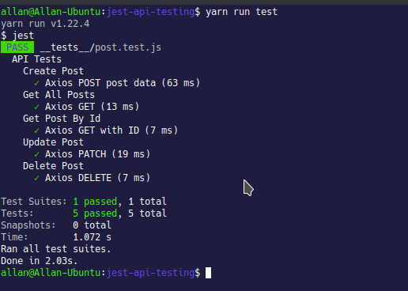

# Testing a REST API using Jest, Axios and mongodb-memory-server

The sample code demonstrates how to run tests on an API using Jest.
The API is mocked with real data using Axios.
mongodb-memory-server creates a mongod instance in memory, so tests are really fast and you also don't have to use your development/production database during testing.
This in my opinion gives a much easier way of testing an API than using something like Postman where the data to be sent has to be manually entered. Or having to work with multiple tabs on Postman for each of the endpoints. 
As powerful as Postman is, using it for testing is still more of a manual process.
This is setup is also ideal for a CI/CD setup.

The result
